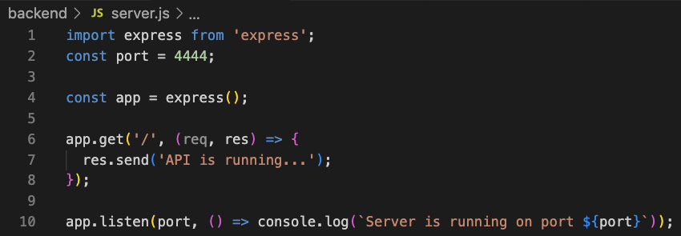
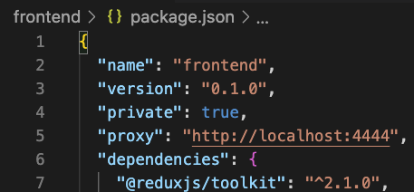

<div style="display: flex; align-items: center;"></div>

# Nazirite Beard Company, Inc
<br>
<p style="color: gray; font-size: 12px;">I am building out my own eCommerce site to sell the beard oil that I have been making using the MERN stack. It will probably be later this year before it goes live as I still have some i's to dot amd t's to cross. But you are welcome to follow along with my development. I will be updating this readme file as much as possible, leaving as many notes as I can. At times I may be somewhat unorganized but in the end I will clean everything up. I usually do not have projects that are in production public like this, but I am just inviting everyone on my journey.</p>
<br>
Phillip Harden
<br>
<br><br><br>

## Frontend

### Node.js
Install [Node.js](https://nodejs.org/en) on local machine.
 
### React 
Create the [React.js](https://react.dev/) folder in the directory with terminal using the command line:

`npx create-react-app frontend`

A helpful extension in VS Code is the [ES7+ React/Redux/React-Native snippets](https://marketplace.visualstudio.com/items?itemName=dsznajder.es7-react-js-snippets)


### React Components

### `rcc`

```javascript
import React, { Component } from 'react'

export default class FileName extends Component {
  render() {
    return <div>$2</div>
  }
}
```

### `rce`

```javascript
import React, { Component } from 'react'

export class FileName extends Component {
  render() {
    return <div>$2</div>
  }
}

export default $1
```

### `rcep`

```javascript
import React, { Component } from 'react'
import PropTypes from 'prop-types'

export class FileName extends Component {
  static propTypes = {}

  render() {
    return <div>$2</div>
  }
}

export default $1
```

### `rpc`

```javascript
import React, { PureComponent } from 'react'

export default class FileName extends PureComponent {
  render() {
    return <div>$2</div>
  }
}
```

### `rpcp`

```javascript
import React, { PureComponent } from 'react'
import PropTypes from 'prop-types'

export default class FileName extends PureComponent {
  static propTypes = {}

  render() {
    return <div>$2</div>
  }
}
```

### `rpce`

```javascript
import React, { PureComponent } from 'react'
import PropTypes from 'prop-types'

export class FileName extends PureComponent {
  static propTypes = {}

  render() {
    return <div>$2</div>
  }
}

export default FileName
```

### `rccp`

```javascript
import React, { Component } from 'react'
import PropTypes from 'prop-types'

export default class FileName extends Component {
  static propTypes = {
    $2: $3,
  }

  render() {
    return <div>$4</div>
  }
}
```

### `rfcp`

```javascript
import React from 'react'
import PropTypes from 'prop-types'

function $1(props) {
  return <div>$0</div>
}

$1.propTypes = {}

export default $1
```

### `rfc`

```javascript
import React from 'react'

export default function $1() {
  return <div>$0</div>
}
```

### `rfce`

```javascript
import React from 'react'

function $1() {
  return <div>$0</div>
}

export default $1
```

### `rafcp`

```javascript
import React from 'react'
import PropTypes from 'prop-types'

const $1 = (props) => {
  return <div>$0</div>
}

$1.propTypes = {}

export default $1
```

### `rafc`

```javascript
import React from 'react'

export const $1 = () => {
  return <div>$0</div>
}
```

### `rafce`

```javascript
import React from 'react'

const $1 = () => {
  return <div>$0</div>
}

export default $1
```

### `rmc`

```javascript
import React, { memo } from 'react'

export default memo(function $1() {
  return <div>$0</div>
})
```

### `rmcp`

```javascript
import React, { memo } from 'react'
import PropTypes from 'prop-types'

const $1 = memo(function $1(props) {
  return <div>$0</div>
})

$1.propTypes = {}

export default $1
```

### `rcredux`

```javascript
import React, { Component } from 'react'
import { connect } from 'react-redux'

export class FileName extends Component {
  render() {
    return <div>$4</div>
  }
}

const mapStateToProps = (state) => ({})

const mapDispatchToProps = {}

export default connect(mapStateToProps, mapDispatchToProps)(FileName)
```

### `rcreduxp`

```javascript
import React, { Component } from 'react'
import PropTypes from 'prop-types'
import { connect } from 'react-redux'

export class FileName extends Component {
  static propTypes = {
    $2: $3,
  }

  render() {
    return <div>$4</div>
  }
}

const mapStateToProps = (state) => ({})

const mapDispatchToProps = {}

export default connect(mapStateToProps, mapDispatchToProps)(FileName)
```

### `rfcredux`

```javascript
import React, { Component } from 'react'
import { connect } from 'react-redux'

export const FileName = () => {
  return <div>$4</div>
}

const mapStateToProps = (state) => ({})

const mapDispatchToProps = {}

export default connect(mapStateToProps, mapDispatchToProps)(FileName)
```

### `rfreduxp`

```javascript
import React, { Component } from 'react'
import PropTypes from 'prop-types'
import { connect } from 'react-redux'

export const FileName = () => {
  return <div>$4</div>
}

FileName.propTypes = {
  $2: $3,
}

const mapStateToProps = (state) => ({})

const mapDispatchToProps = {}

export default connect(mapStateToProps, mapDispatchToProps)(FileName)
```

### `reduxmap`

```javascript
const mapStateToProps = (state) => ({})

const mapDispatchToProps = {}
```

## React Native Components

### `rnc`

```javascript
import React, { Component } from 'react'
import { Text, View } from 'react-native'

export default class FileName extends Component {
  render() {
    return (
      <View>
        <Text> $2 </Text>
      </View>
    )
  }
}
```

### `rnf`

```javascript
import React from 'react'
import { View, Text } from 'react-native'

export default function $1() {
  return (
    <View>
      <Text> $2 </Text>
    </View>
  )
}
```

### `rnfs`

```javascript
import React from 'react'
import { StyleSheet, View, Text } from 'react-native'

export default function $1() {
  return (
    <View>
      <Text> $2 </Text>
    </View>
  )
}

const styles = StyleSheet.create({})
```

### `rnfe`

```javascript
import React from 'react'
import { View, Text } from 'react-native'

const $1 = () => {
  return (
    <View>
      <Text> $2 </Text>
    </View>
  )
}

export default $1
```

### `rnfes`

```javascript
import React from 'react'
import { StyleSheet, View, Text } from 'react-native'

const $1 = () => {
  return (
    <View>
      <Text> $2 </Text>
    </View>
  )
}

export default $1

const styles = StyleSheet.create({})
```

### `rncs`

```javascript
import React, { Component } from 'react'
import { Text, StyleSheet, View } from 'react-native'

export default class FileName extends Component {
  render() {
    return (
      <View>
        <Text> $2 </Text>
      </View>
    )
  }
}

const styles = StyleSheet.create({})
```

### `rnce`

```javascript
import React, { Component } from 'react'
import { Text, View } from 'react-native'

export class FileName extends Component {
  render() {
    return (
      <View>
        <Text> $2 </Text>
      </View>
    )
  }
}

export default $1
```

## Others

### `cmmb`

```JS
/**
|--------------------------------------------------
| $1
|--------------------------------------------------
*/
```

### `desc`

```javascript
describe('$1', () => {
  $2
})
```

### `test`

```javascript
test('should $1', () => {
  $2
})
```

### `tit`

```javascript
it('should $1', () => {
  $2
})
```

### `stest`

```javascript
import React from 'react'
import renderer from 'react-test-renderer'

import { $1 } from '../$1'

describe('<$1 />', () => {
  const defaultProps = {}
  const wrapper = renderer.create(<$1 {...defaultProps} />)

  test('render', () => {
    expect(wrapper).toMatchSnapshot()
  })
})
```

### `srtest`

```javascript
import React from 'react'
import renderer from 'react-test-renderer'
import { Provider } from 'react-redux'

import store from 'src/store'
import { $1 } from '../$1'

describe('<$1 />', () => {
  const defaultProps = {}
  const wrapper = renderer.create(
    <Provider store={store}>
      <$1 {...defaultProps} />)
    </Provider>,
  )

  test('render', () => {
    expect(wrapper).toMatchSnapshot()
  })
})
```

### `sntest`

```javascript
import 'react-native'
import React from 'react'
import renderer from 'react-test-renderer'

import $1 from '../$1'

describe('<$1 />', () => {
  const defaultProps = {}

  const wrapper = renderer.create(<$1 {...defaultProps} />)

  test('render', () => {
    expect(wrapper).toMatchSnapshot()
  })
})
```

### `snrtest`

```javascript
import 'react-native'
import React from 'react'
import renderer from 'react-test-renderer'
import { Provider } from 'react-redux'

import store from 'src/store/configureStore'
import $1 from '../$1'

describe('<$1 />', () => {
  const defaultProps = {}
  const wrapper = renderer.create(
    <Provider store={store}>
      <$1 {...defaultProps} />
    </Provider>,
  )

  test('render', () => {
    expect(wrapper).toMatchSnapshot()
  })
})
```

### `hocredux`

```javascript
import React from 'react'
import PropTypes from 'prop-types'
import { connect } from 'react-redux'

export const mapStateToProps = (state) => ({})

export const mapDispatchToProps = {}

export const $1 = (WrappedComponent) => {
  const hocComponent = ({ ...props }) => <WrappedComponent {...props} />

  hocComponent.propTypes = {}

  return hocComponent
}

export default (WrapperComponent) =>
  connect(mapStateToProps, mapDispatchToProps)($1(WrapperComponent))
```

### `hoc`

```javascript
import React from 'react'
import PropTypes from 'prop-types'

export default (WrappedComponent) => {
  const hocComponent = ({ ...props }) => <WrappedComponent {...props} />

  hocComponent.propTypes = {}

  return hocComponent
}
```


## Bootstrap

I am using 

* React-Bootstrap [npm](https://www.npmjs.com/package/react-bootstrap) / [react](https://react-bootstrap.netlify.app/)
* [Bootstrap](https://getbootstrap.com/)
* React Icons: [npm](https://www.npmjs.com/package/react-icons) / [GitHub Pages](https://react-icons.github.io/react-icons/)

To install all 3, use the terminal command:

`npm i react-bootstrap bootstrap react-icons`

Make sure you are inside the "frontend" folder and not in the man directory. 
 
Next, I will go to the index.js file located in the src folder in the frontend folder, and then import bootstrap using :

`import 'bootstrap/dist/css/bootstrap.min.css'; `


##Screens

I will be adding screens, or pages, to the project. Screens such as Home screen, Catelog screen, Product Details scren, etc. 


### React Router Dom

[npm](https://www.npmjs.com/package/react-router-dom) 

npm i react-router-dom

I added my routes in the index.js file

Import 

`import { createBrowserRouter, createRoutesFromElements, Route, RouterProvider } from 'react-router-dom';`


Then add a router:

`const router = createBrowserRouter(
  createRoutesFromElements(
    <Route path="/" element={<App />}>
      <Route index={true} path="/" element={<HomeScreen />} /> 
    </Route>
  )
)`

[React Router Bootstrap ](https://www.npmjs.com/package/react-router-bootstrap)

Terminal installing command:

`npm i react-router-bootstrap`

<br><br><br><br><br><br><br><br><br><br><br><br><br>

# Backend


<br>

## Setup


### [Node.js](https://nodejs.org/en)

Back in the root folder/directory I want to create a server-side package.json and any dependencies I use will go into a node_modules folder in the root as well. To create this I will use the terminal command:

`npm init`

I will use server.js instead of index.js just to help me keep tings more organized and have the naming convention make more sense to me.

<br>

### [CommonJS vs ES Modules for Express Node](https://stackoverflow.com/questions/77120722/commonjs-vs-es-modules-for-express-node)

I want to use ES modules so in the package.json I wall add:

`"type": "module",`

By default, Node.js uses common.js, for example:

`const express = require("express");`

ES Modules syntax will import like this:s

`import express from 'express';`

<br>

In my package.json I will replace the "test" with "start":

`"scripts": {
    "start": "node backend/server.js",  
  }`

This allows the termonal command (from the root directory)...

`npm start`

...to run the server.js

### Express Dependencies


#### [Express](https://expressjs.com/)

`npm i express`

Here's how I initially set up the server.js for testing purposes...




<br>

#### * Side Note

There is a great Chrome extension called [JSON Formatter](https://chromewebstore.google.com/detail/json-formatter/bcjindcccaagfpapjjmafapmmgkkhgoa?hl=en-US&utm_source=ext_sidebar) that ill format the JSON data that I get back from my server during the production/testing period of my project.

<br>

In my backend folder I created another folder called "data", there I put my products.js file which is a JSON file of my products so that I can pull data from there until I get my database set up later. 


## Nodemon


[Nodemon](https://nodemon.io/)

[Install](https://www.npmjs.com/package/nodemon)

(-D will install as a dev dependency being that I will not need these in production)

`npm i -D nodemon`

Nodemon will allow me to make chages and have them go into effect without restarting the server.


## Concurrently

[Concurrently](https://www.npmjs.com/package/concurrently) will allow me to run multiple commands concurrently, this way I can start my frontend & backend at the same time using only one terminal command.

`npm i -D concurrently`


<br>

In my root package.json, I will add command to the "script"...

For the backend/server add...

`"server": "nodemon backend/server.js"`

For the frontend add...

`"client": "npm start --prefix frontend"`

And now to run both of these commands using concurrently, add...

`"dev": "concurrently \"npm run server\" \"npm run client\""`


## Environment Variables

[dotenv](https://www.npmjs.com/package/dotenv)

`npm i -D dotenv`

Install it as a dev dependency becasue once in production, these variables will be stored in the database.
In the root, create a file called .env

In the server.js file, I have to import dotenv

`import dotenv from 'dotenv';`

Then call the config method right under the import

`dotenv.config();`

In the .evn file I created a PORT variable

`PORT=8888`

Now I will create a variable to pull the variable from the .env file.

`const port = process.env.PORT || 4444;`


The "|| 4444" is my fall back incase the PORT is not available, in which case it would use the 4444 instead of the 8888.


<br>
## Axios


Instead of using fetch() I will be using [axios](https://www.axios.com/).

[npm axios](https://www.axios.com/)

Through terminal I will `cd frontend/` and install axios using the command line:

`npm i axios`

Once I go into production, to avoid typing out the entire url to fetch data, 

 Example:
 
`fetch('http://localhost:4444/products');`

vs.

`fetch('/products');`


I will add a proxy to the package.json file in the frontend folder.
  
`"proxy": "http://localhost:4444"  `



Once in production, I will change the url to the url of my database API.


<br><br><br><br><br><br><br><br><br><br><br><br><br><br><br><br><br><br><br><br><br><br><br><br><br><br><br><br><br><br><br><br><br><br><br><br><br><br><br><br><br><br><br><br><br><br><br><br><br><br><br><br><br><br><br><br><br><br><br><br><br><br><br><br><br><br><br><br><br><br><br><br><br><br><br><br><br><br><br><br><br><br><br><br><br><br><br><br><br><br><br><br><br><br><br><br><br><br><br><br><br><br><br><br><br><br><br><br><br><br><br><br><br><br><br><br><br><br><br><br><br><br><br><br><br><br><br><br><br><br>
<br>

## MongoDB


### [mongoDB](https://www.mongodb.com/)

[My clusters](https://cloud.mongodb.com/v2/656142bd33d2300fbbd2debd#/clusters) (only I have access to this)

<br>

## Mongoose


### [mongoosejs.com](https://mongoosejs.com/)

db.js file:

`import mongoose from 'mongoose';`

const connectDB = async () => {
  try {
    const conn = await mongoose.connect(process.env.MONGO_URI);
    console.log(`Mongoose Connected: ${conn.connection.host}`);
  } catch (error) {
    console.log(`Error: ${error.message}`);
    process.exit(1);
  }
};
* 
export default connectDB;`


seeder.js
add or delete database

The commands are in the package.json listed under:

`"data:import": "node backend/seeder.js",`

`"data:destroy": "node backend/seeder.js -d"`

In termininal you will run these commands in the root directory:

`npm run data:import`

`npm run data:destroy`


## Redux & Redux-toolkit

[Redux](https://redux.js.org/)

[Redux Toolkit](https://redux-toolkit.js.org/)


